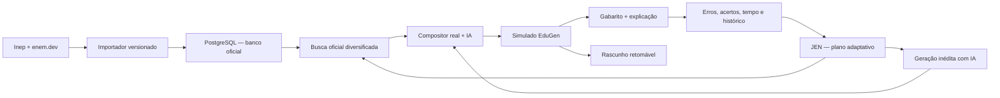

# EduGen + JEN — arquitetura, algoritmo adaptativo e fluxo ENEM

Este documento descreve a implementação atual do EduGen para estudantes, incluindo o agente JEN, o banco de questões ENEM/SAEB, a mistura de questões oficiais com questões inéditas, o algoritmo de recomendação, o gabarito comentado, as imagens, o histórico e a continuação de simulados.

> Importante: `enem.dev` é o provedor estruturado usado para importar os dados das questões. A fonte oficial exibida ao estudante continua sendo o Inep. Questões geradas por IA nunca recebem o selo de questão oficial.

## 1. Visão geral

O fluxo possui cinco camadas:

1. **Ingestão:** importa questões estruturadas e gabaritos do ENEM e cataloga documentos públicos do Inep.
2. **Banco oficial:** normaliza questões, alternativas, gabaritos, imagens, área, ano e proveniência em PostgreSQL.
3. **JEN adaptativo:** analisa erros, acertos, tempo de resposta, recência e repetições para montar um plano de vulnerabilidades.
4. **Compositor:** seleciona questões reais de diferentes anos, evita repetições recentes e completa o simulado com questões inéditas geradas pela IA.
5. **Experiência do estudante:** apresenta questão, imagem, origem, gabarito, explicação, progresso, histórico e continuação.



## 2. Arquivos principais

| Arquivo | Responsabilidade |
| --- | --- |
| `client/src/pages/EduGen.tsx` | Fluxo do estudante, geração, resolução, gabarito, salvamento automático, histórico e continuação. |
| `client/src/components/AssessmentModeSelector.tsx` | Modos Escolar, ENEM, SAEB e Misto. |
| `server/routes.ts` | Endpoints do EduGen, geração com IA, proxy de imagens, explicação JEN e persistência. |
| `server/officialExamBank.ts` | Importação, mapeamento e leitura das questões oficiais. |
| `server/officialExamRepository.ts` | Esquema PostgreSQL e seleção de itens oficiais. |
| `server/edugenAdaptive.ts` | Cálculo puro do plano adaptativo e da composição real + IA. |
| `server/edugenMedia.ts` | Validação e reescrita segura das URLs de imagens oficiais. |
| `server/edugenStore.ts` | Sessões concluídas, rascunhos em andamento, progresso e erros. |
| `shared/schema.ts` | Contratos compartilhados de questão, simulado, resposta e plano adaptativo. |
| `server/importOfficialExams.ts` | Comando de importação manual do banco oficial. |

## 3. Como o banco ENEM é importado

### 3.1 Fontes

- Questões estruturadas: `https://api.enem.dev/v1`.
- Proveniência oficial e documentos: páginas de provas e gabaritos do Inep.
- Anos estruturados importados atualmente: 2009 a 2023.
- Catálogo público de documentos: 1998 a 2025.
- SAEB: itens públicos liberados e comentados, sem importar conteúdo protegido do BNI.

### 3.2 Comando

```bash
npm run exams:import
```

Para refazer anos que já estão marcados como estruturados:

```bash
npm run exams:import -- --force
```

O importador:

1. abre uma execução em `official_exam_import_runs`;
2. verifica quais anos já foram estruturados;
3. pagina a API em blocos de 50 questões;
4. respeita `429 Retry-After` e faz até três tentativas;
5. espera 1,1 segundo entre páginas/anos quando necessário;
6. normaliza os dados;
7. executa `upsert`, portanto uma nova importação não duplica itens;
8. cataloga PDFs públicos do Inep por tipo;
9. finaliza a execução como `complete` ou `failed`.

### 3.3 Normalização

Cada questão oficial recebe:

- ID estável: `enem-{ano}-{numero}`;
- ano e número da questão;
- disciplina/área normalizada;
- texto do contexto e introdução das alternativas;
- alternativas `a`, `b`, `c`, `d`, `e` quando existentes;
- `correctOptionId` vindo do gabarito estruturado;
- imagens do enunciado e de alternativas;
- URL oficial do Inep;
- URL auxiliar do provedor estruturado;
- estimativa de complexidade;
- metadados de idioma para Inglês/Espanhol.